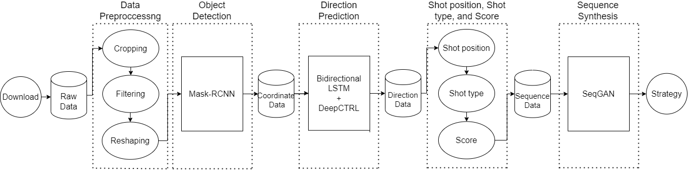

# Badminton-winner-strategy-synthesis-based-on-player-position-motions

## The flows for the paper

<center></center>

File name: rawdatavideo, which includes the screenshots from badminton videos.
```
ChenYuFei:
PusarlaVSindhu:
PornpaweeChochuwang:
RatchanokIntanon:
AnSeYoung:
CarolinaMarin: 

```

## 1. Preprocessing

download video from Youtube, and use **preprocessing.ipynb** to do the screenshots for each 0.5 second from a video.

```
preprocessing.ipynb
```

## 2. Mask-RCNN

input screenshots into the Mask-RCNN

```
https://drive.google.com/drive/u/0/folders/1_a5xSPQmE2_ODqcY9OuobZNOXugOBC2b
```

## 3. Bi-LSTM

predict diraction for each shuttlecock by Bi-LSTM and logic control

```
https://github.com/chi110356042/logic_badminton
```

## 4. Automatic programs stage before SeqGAN 

```
hit,birdy,score,seqs.ipynb(HIT2SCORE)
```


## 5. SeqGAN

```
seqgan_input.ipynb(SCORE2SEQ)

execute-hiseqgan.py:(SEQGAN)

python execute-hiseqgan.py --data=wm5-normalize --filename=seqGAN_input_hs12_22.txt --target=id --generated_num=100 --total_batch=50 --batch_size=5 --seq_length=40

seqgan_output.ipynb(seqganoutput)
```
## 6. Statistic 

```
pie chart(1 com).ipynb
pie chart(2 com).ipynb
pie chart(3 com).ipynb

攻擊比例統計分析.ipynb
```


